# angstromCTF

Enlace: https://2020.angstromctf.com/

Fechas: 14 a 18 de marzo

-----------------------------------


## MISC

### Ws1

30 puntos

Enunciado: *Find my password from this recording (:
Author: JoshDaBosh*

La flag está en claro en un paquete HTTP:

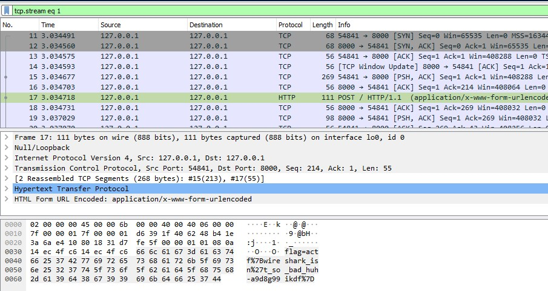


### Clamclam

70 puntos

Enunciado: *clam clam clam clam clam clam clam clam clam nc misc.2020.chall.actf.co 20204 clam clam clam clam clam clam
Author: aplet123*

Simplemente escribiendo "clamclam" te devuelve la flag:

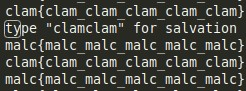


### Ws2

80 puntos

Enunciado: *No ascii, not problem :)
recording.pcapng
Author: JoshDaBosh*

Basta con abrir el fichero PCAP con NetworkMiner:

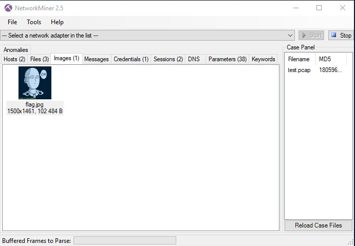


### PSK

90 puntos

Enunciado: *My friend sent my yet another mysterious recording...
He told me he was inspired by PicoCTF 2019 and made his own transmissions. I've looked at it, and it seems to be really compact and efficient.
Only 31 bps!!
See if you can decode what he sent to me. It's in actf{} format
Author: JoshDaBosh*

Se descarga el program fldigi y se configura para PSK-31:

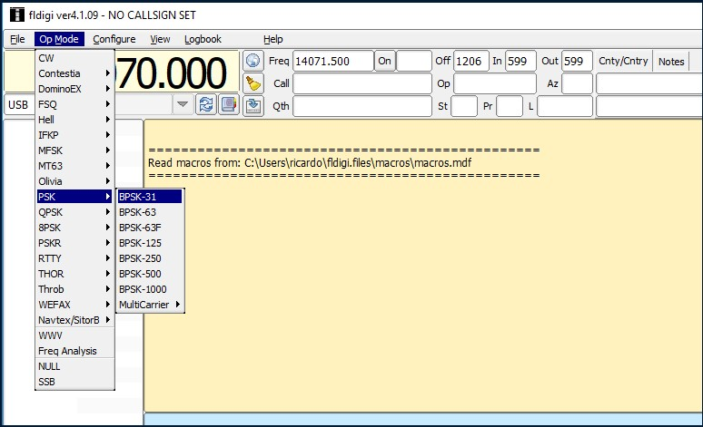

Se importa el audio:

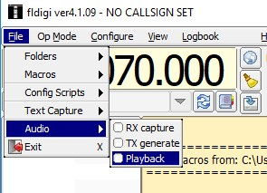

Y se puede leer la flag:

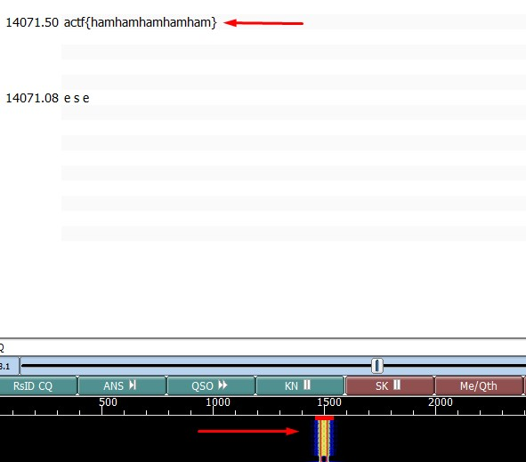


### Inputter

100 puntos

Enunciado: *Clam really likes challenging himself. When he learned about all these weird unprintable ASCII characters he just HAD to put it in a challenge. Can you satisfy his knack for strange and hard-to-input characters? Source.
Find it on the shell server at /problems/2020/inputter/.
Author: aplet123*

La idea es enviar dos cadenas con caracteres no imprimibles, una como argumento de entrada y otra a la función fgets():


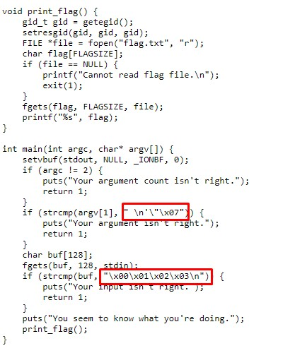

Para eso se puede usar Python y abrir un proceso con pwnlib.tubes.process, poner como argumento la primera cadena y luego enviar el segundo al socket que acabamos de abrir.

```
import pwnlib.tubes.process as process
arg1 = " \n'\"\x07"
conn = process.process(executable="./inputter",argv=["1",arg1])
arg2 = "\x00\x01\x02\x03"
conn.sendline(arg2)
conn.recv(1024)
```

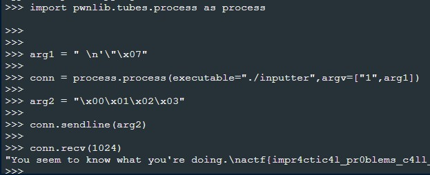


### Msd

140 puntos

Enunciado: *You thought Angstrom would have a stereotypical LSB challenge... You were wrong! To spice it up, we're now using the Most Significant Digit. Can you still power through it?
Here's the encoded image, and here's the original image, for the... well, you'll see.
Important: Redownload the image if you have one from before 11:30 AM 3/14/20. Important: Don't use Python 3.8, use an older version of Python 3!
Author: JoshDaBosh*

Este es el código:

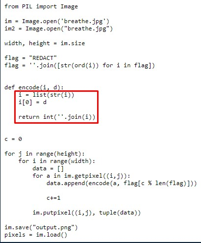


La idea es que a la hora de codificar, se envía a la función encode dos argumentos: el valor de cada dimensión del pixel y un caracter de la variable *flag*. Pero dicha variable no es el string inicial (donde pone *REDACT*), es la concatenación de los valores numéricos ASCII. Por tanto, este segundo argumento va a ser un número del 0 al 9.

Por tanto se puede hacer fuerza bruta a esos 10 valores y ver con cuál de los diez se cumple que el "valor de la dimensión del pixel de la imagen final" es igual al "valor del pixel transformado". El código quedaría así:

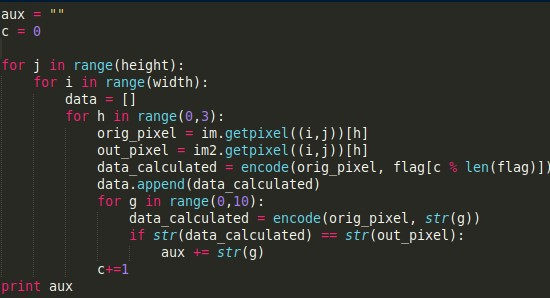

Luego se saca los valores numéricos ASCII de "actf" porque estará en la flag:

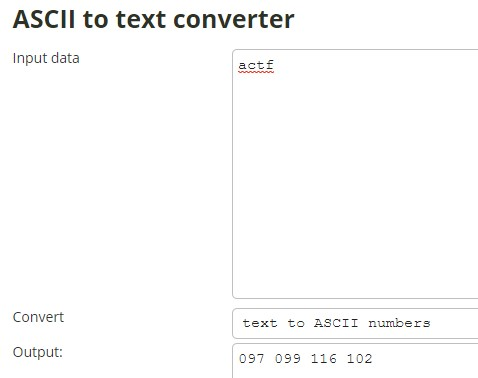

Se detecta en dos posiciones y una de estas devuelve el valor:

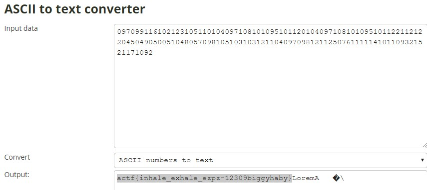


### Shifter

160 puntos

Enunciado: *What a strange challenge...
It'll be no problem for you, of course!
nc misc.2020.chall.actf.co 20300
Author: JoshDaBosh*

Cada vez que te conectas te manda una cadena de caracteres y te pide que lo rotes con el cifrado César. El número de rotaciones no es el número que te manda (pongamos X), si no el valor del número de Fibonacci (es decir el X número de la serie de Fibonacci)

Sacamos los números de Fibonacci de https://oeis.org/A000045/b000045.txt y los formateamos:

```
cat /tmp/w | cut -d " " -f 2 | sed -ze 's/\n/,/g'; echo
```

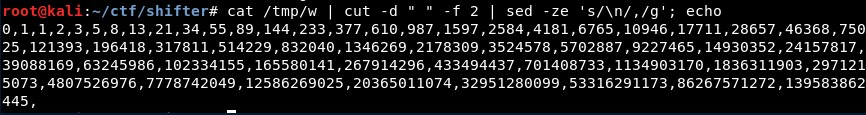


El script final es el siguiente:

```
import socket

fibonumbers = [0,1,1,2,3,5,8,13,21,34,55,89,144,233,377,610,987,1597,2584,4181,6765,10946,17711,28657,46368,75025,121393,196418,317811,514229,832040,1346269,2178309,3524578,5702887,9227465,14930352,24157817,39088169,63245986,102334155,165580141,267914296,433494437,701408733,1134903170,1836311903,2971215073,4807526976,7778742049,12586269025,20365011074,32951280099,53316291173,86267571272,139583862445]

def encrypt(text,s):
   res = ""
   for i in range(len(text)):
      char = text[i]
      if (char.isupper()):
         res += chr((ord(char) + s-65) % 26 + 65)
      else:
         res += chr((ord(char) + s - 97) % 26 + 97)
   return res

s = socket.socket(socket.AF_INET, socket.SOCK_STREAM)
s.connect(("misc.2020.chall.actf.co", 20300))

print len(fibonumbers)

for i in range(0,52):
   data = s.recv(1024)
   print data
   splitted = data.split("Shift")[1].split(" ")
   text = splitted[1]
   number = (splitted[3].split("=")[1].split("\n")[0])
   encrypted1 = encrypt(text,fibonumbers[(int(number))])
   encrypted2 = encrypt(text,(int(number)))
   print text, number, encrypted1, encrypted2
   s.send(encrypted1+"\n")

```

### Ws3

180 puntos

Enunciado: *What the... record.pcapng
Author: JoshDaBosh*

Es un PCAP y vemos tráfico a una web con una ruta con un Git. Primero extraemos los ficheros HTTP

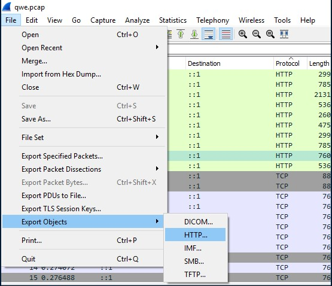

Algunos de estos ficheros tienen la palabra PACK:

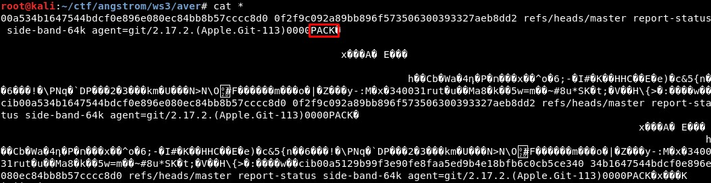

Se cambian las cabeceras de estos:

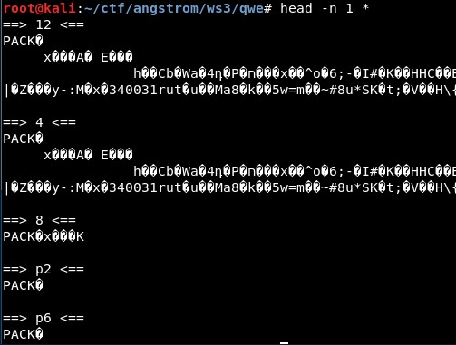

Ahora se reconocen como ficheros PACK:

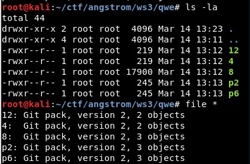

Probamos a importarlos:

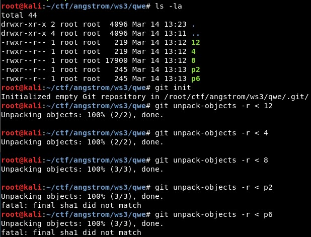

Si probamos a ejecutar el Extractor de [Gittools](https://github.com/internetwache/GitTools) vemos que hay varios ficheros, uno de ellos *flag.jpg*:

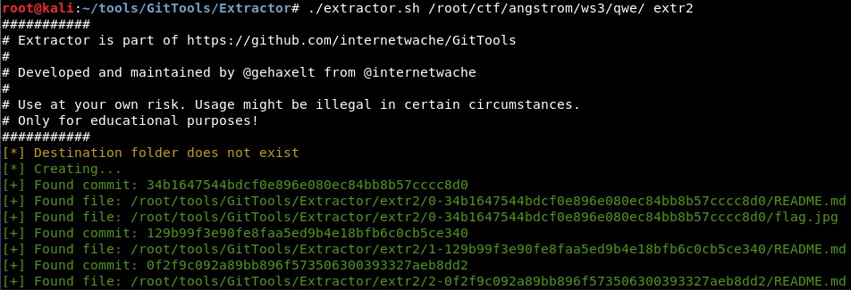

It contains the flag:)

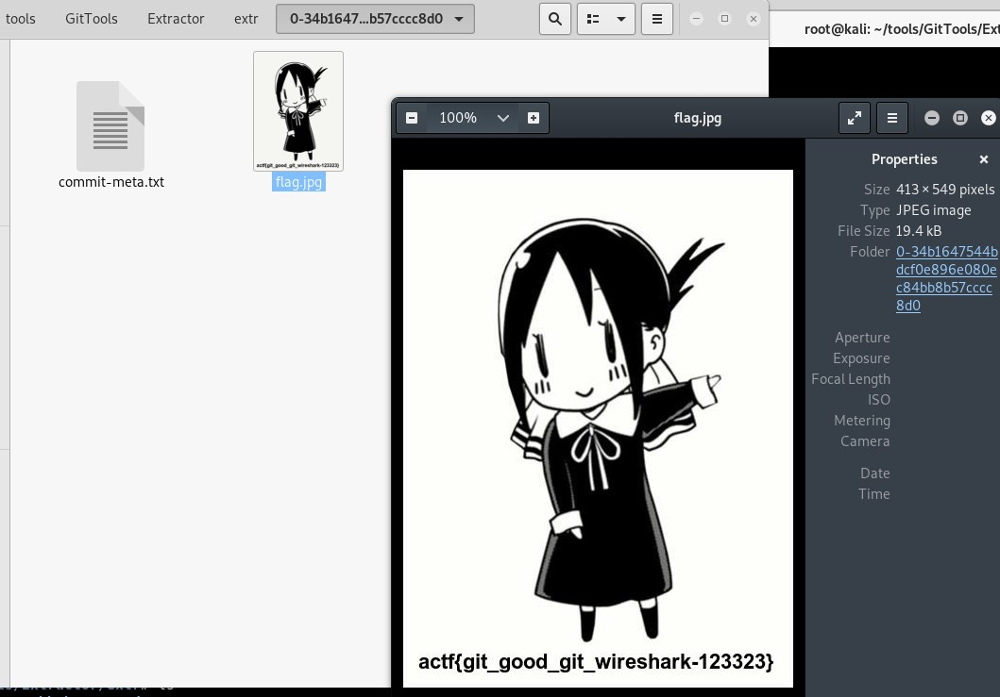


----------------------------------------------


## WEB

### The magic word

20 puntos

Enunciado: *Ask and you shall receive...that is as long as you use the magic word.
Author: aplet123*

Simplemente hay que inspeccionar el elemento de HTML con la frase "give flag" y poner "please give flag":

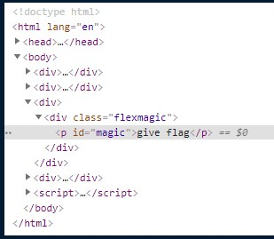


### Git good

70 puntos

Enunciado: *Did you know that angstrom has a git repo for all the challenges? I noticed that clam committed a very work in progress challenge so I thought it was worth sharing.
Author: aplet123*

Se puede extraer los contenidos con el Dumper de [Gittools](https://github.com/internetwache/GitTools):

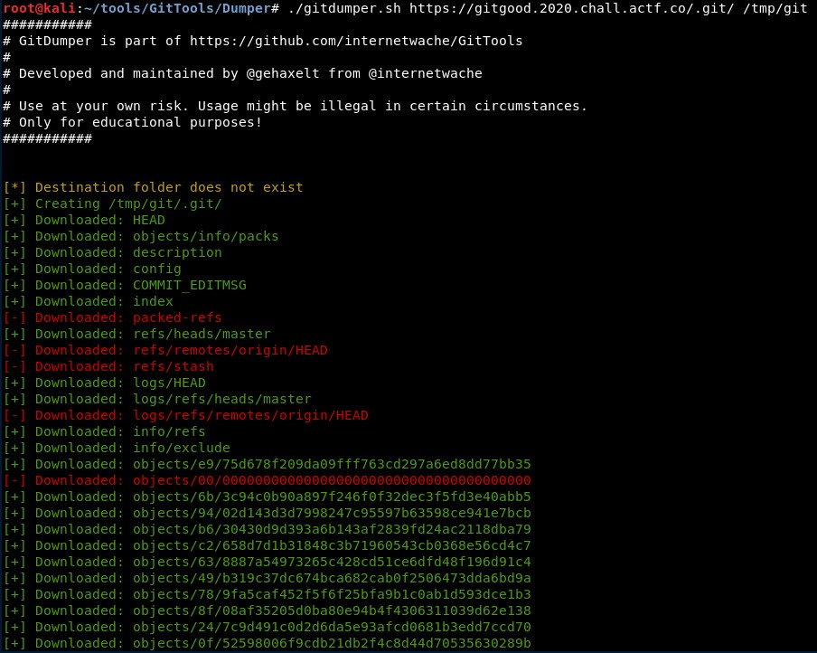

Ahora listamos los commits y revertimos uno anterior

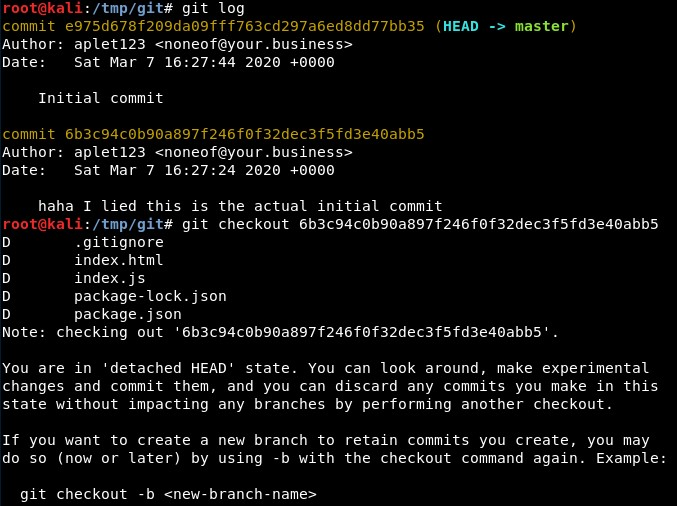

Por último vemos que la flag está entre los ficheros:

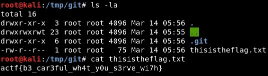


### Secret agents


### Xmas still stands


----------------------------------------------


## CRYPTO

### Keysar

40 puntos

Enunciado: *Hey! My friend sent me a message... He said encrypted it with the key ANGSTROMCTF.
He mumbled what cipher he used, but I think I have a clue.
Gotta go though, I have history homework!!
agqr{yue_stdcgciup_padas}
Author: joshdabosh*

Es un cifrado César con clave, se puede resolver aquí: http://rumkin.com/tools/cipher/caesar-keyed.php


### Reasonably strong algorithm

70 puntos 

Enunciado: *RSA strikes again!*

```
./RsaCtfTool.py -n 126390312099294739294606157407778835887 -e 65537 --uncipher 13612260682947644362892911986815626931
```

### Wacko images

90 puntos

Enunciado: *How to make hiding stuff a e s t h e t i c? And can you make it normal again? enc.png image-encryption.py
The flag is actf{x#xx#xx_xx#xxx} where x represents any lowercase letter and # represents any one digit number.
Author: floorthfloor*

Primero vemos el código utilizado para codificar la imagen:

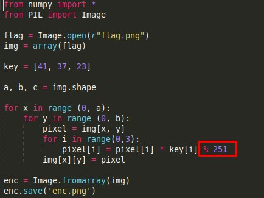

Como se coge el resto de 251 y los píxeles tienen valores de 0 a 255, se puede calcular todos los valores que se pueden traducir:

```
key = [41, 37, 23]
for j in range(0,3):
	arr = []
	for i in range(0,255):
	 res = i * key[j] % 251
	 arr.append({'new_val':res,'orig_val':i})
	print arr
	print ""
```

Con esas tres listas se puede ejecutar lo siguiente:

```
from numpy import *
from PIL import Image
import numpy as np

flag = Image.open(r"enc.png")
img = array(flag)

key = [41, 37, 23]

arr_41 = [{'new_val': 0, 'orig_val': 0}, {'new_val': 41, 'orig_val': 1}, ...]
arr_37 = [{'new_val': 0, 'orig_val': 0}, {'new_val': 37, 'orig_val': 1}, ...]
arr_23 = [{'new_val': 0, 'orig_val': 0}, {'new_val': 23, 'orig_val': 1}, ...]

a, b, c = img.shape

for x in range (0, a):
    for y in range (0, b):
        pixel = img[x, y]
        for i in arr_41:
            if pixel[0] == i['new_val']:
                pixel[0] = i['orig_val']
       
        for j in arr_37:
            if pixel[1] == j['new_val']:
                pixel[1] = j['orig_val']
       
        for k in arr_23:
            if pixel[2] == k['new_val']:
                pixel[2] = k['orig_val']
       
        img[x][y] = pixel
enc = Image.fromarray(img)
enc.save('flag.png')from numpy import *
```

### Confused streaming

100 puntos

Enunciado: *I made a stream cipher!
nc crypto.2020.chall.actf.co 20601*

Vemos en el código que se tienen que cumplir varios requisitos en los tres argumentos de entrada para no generar una excepción:

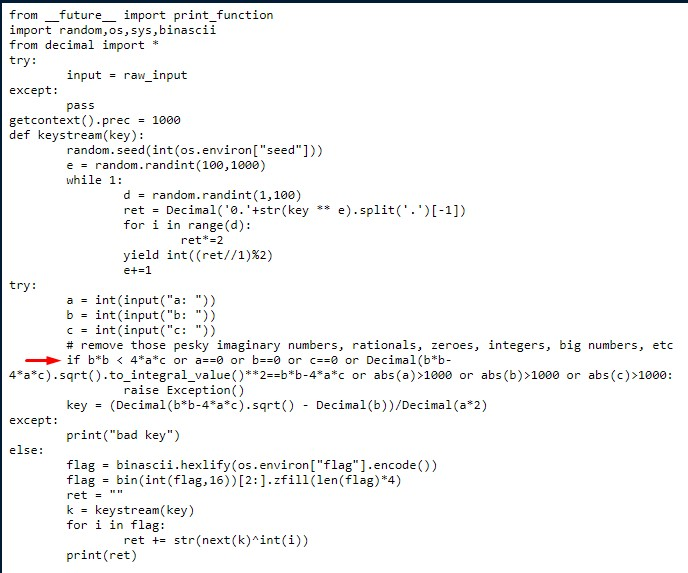

Estos requisitos se pueden traducir a que:

- Los argumentos de entrada sean enteros entre 1 y 1000 o -1000 y -1

- 4xaxc  >= bxb

- bxb-4xaxc >= 0 para no romper la raíz cuadrada

Probamos con -1, 2 y 1, con lo que se cumple la sentencia:

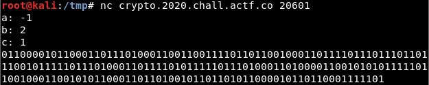

Se traduce el código binario a ASCII y obtenemos la flag.