# angstromCTF

Enlace: https://ctf.auburn.edu/

Fechas: 4 a 5 de abril

-----------------------------------

## Signals


### FCC Hunter

Parece que debemos encontrar la frecuencia que utilizan los autobuses de un servicio de la universidad que se llama Tiger Transit:

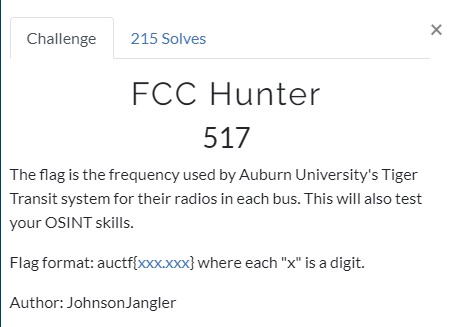

Finalmente encontramos la web https://www.radioreference.com/:

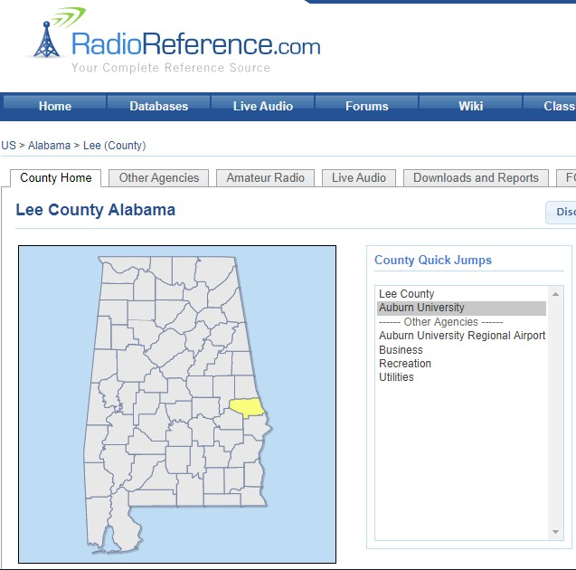

Comprobando las frecuencias de la zona universitaria vemos que hay una para los autobuses:

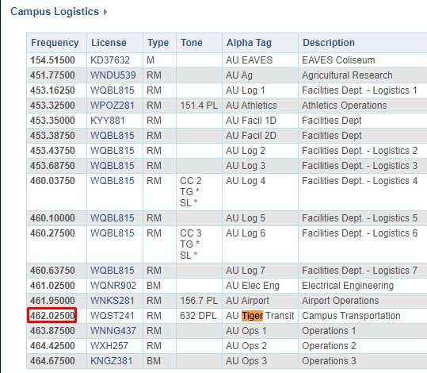


  

### Digital

Tenemos que obtener el mensaje de un audio:

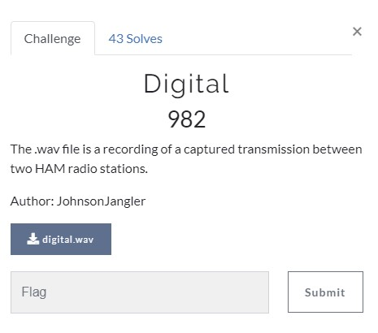

Utilizando fldigi probamos varias opciones hasta que se descubre que es una señal en BPSK-63:

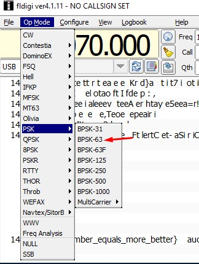

Y se obtiene la flag en una de estas frecuencias:

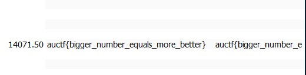


-----------------------------------

## Password cracking


### Mental

Parece que la contraseña podría ser el MD5 de concatenar Color-País-Fruta:

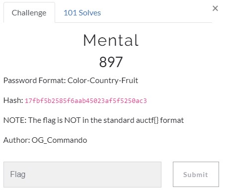

Se descarga una lista de palabras de colores, países y frutas y se prueba con un script de Python:

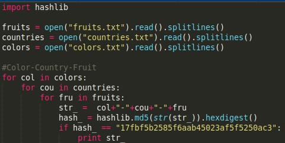

Y se obtiene rápidamente el valor:

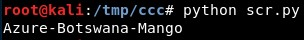


### Manager

Se parte de un Keepass con contraseña:

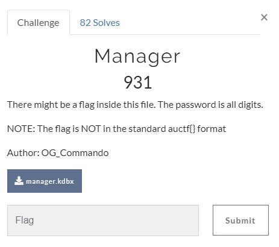

Como se sabe que la contraseña son solo números, se puede crackear con:

```
hashcat64.exe -m 13400 -a 3 -O -w 3 manager.hash -i -1 ?d ?1?1?1?1?1?1?1?1
```

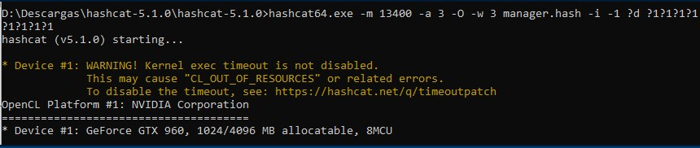

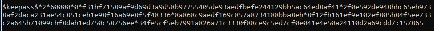

Simplemente abrimos el Keepass y se obtiene la flag:

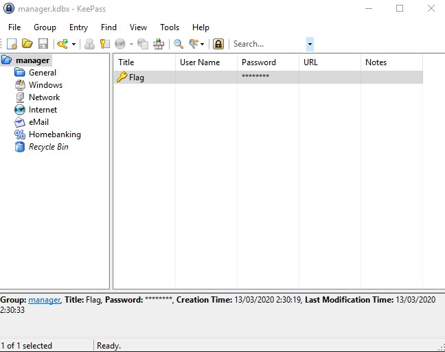


  
### Salty

Es un hash con su salt:

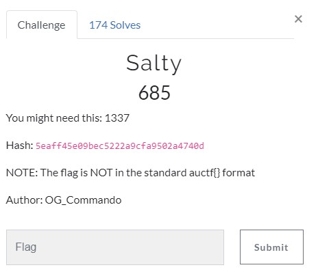

Se prueban distintas opciones de hashcat:

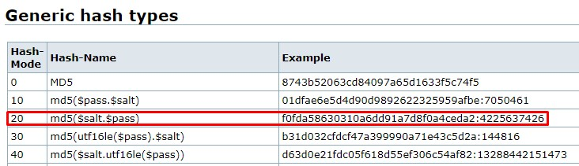

Hasta que se consigue crackear con una de estas:

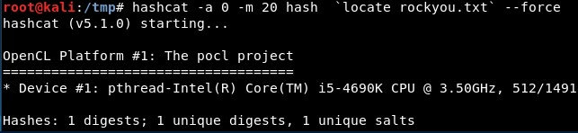


  
### Zippy

Se trata de ficheros zip dentro de otros ficheros zip, todos con contraseña. Simplemente usando zip2john (de John the ripper) se pueden obtener las contraseñas:

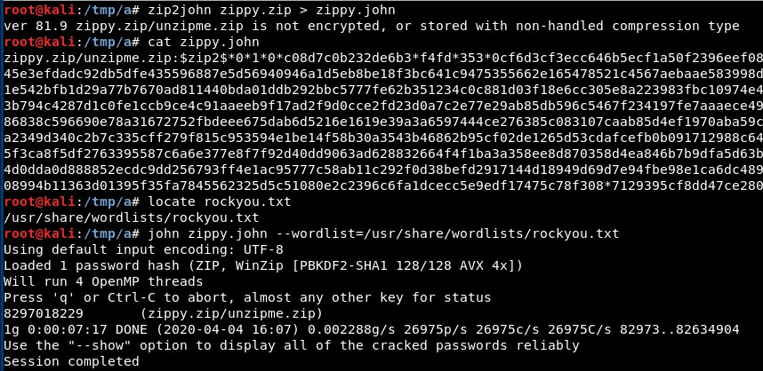

  

### Big Mac

Es un hash sin salt:

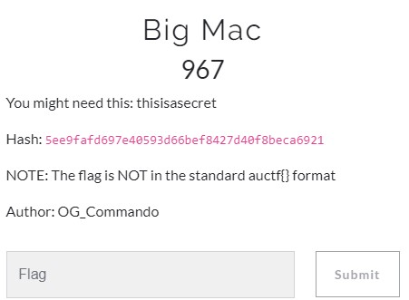

Podría ser un SHA-1:

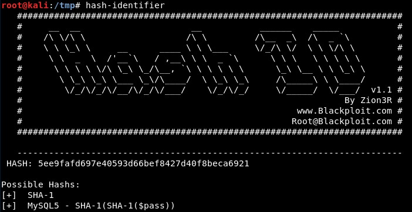

En hashcat llaman la atención los de HMAC-SHA1 por el título:

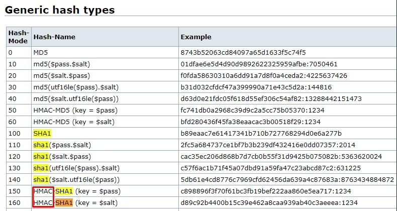

Y se puede crackear con 

```
hashcat -a 0 -O -w 3 -m 160 sha1.txt /usr/share/wordlists/rockyou.txt --force
```

-----------------------------------

## Forensics


### Har har har

Primero vemos qué es el fichero:

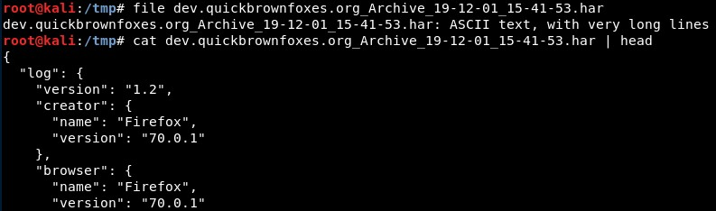

De [la Wikipedia](https://es.wikipedia.org/wiki/.har), tenemos que el formato HTTP Archive o HAR, es un formato de un fichero de archivo en formato JSON, para el registro de la interacción de un navegador web con un sitio. La extensión común para estos archivos es .har.

De hecho parece que contienen una imagen en base64:

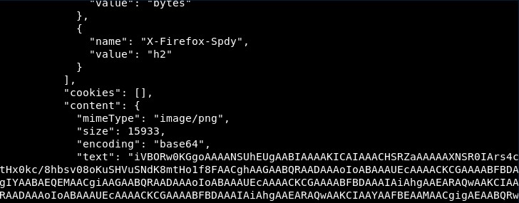

La abrimos en línea y tenemos la flag:

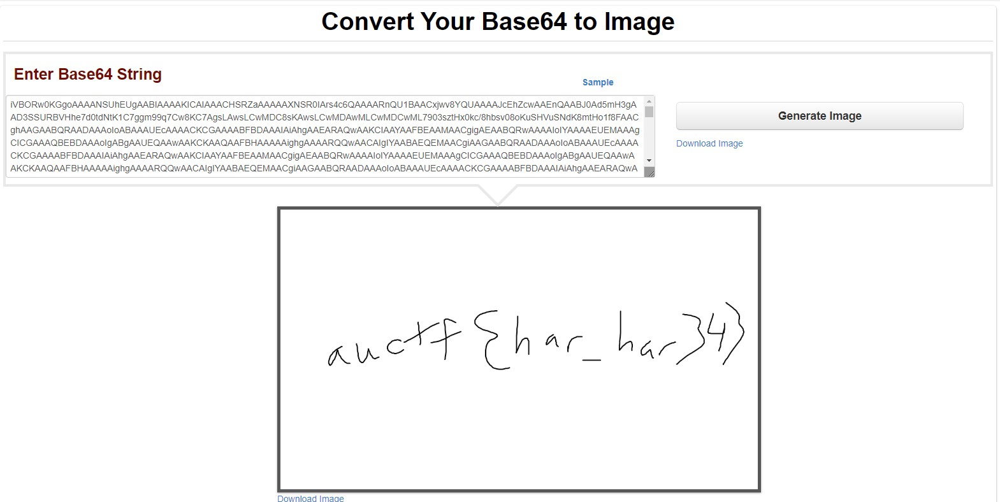

  


### mobile0

Debemos encontrar una flag en un fichero IPA:

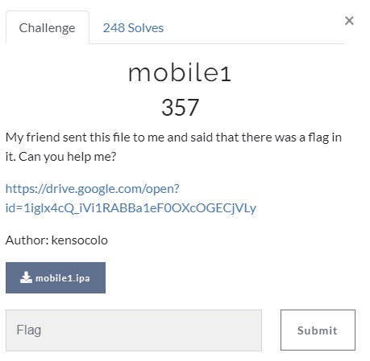

Lo descomprimimos como si fuera un zip:

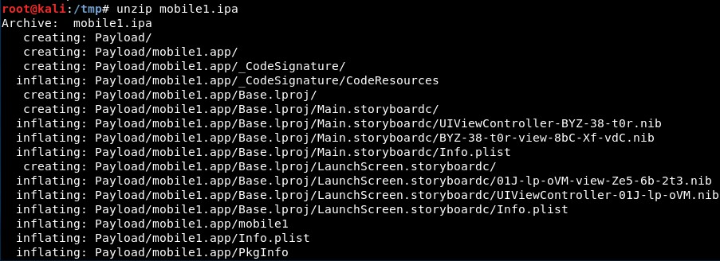

Y se encuentra rápidamente:

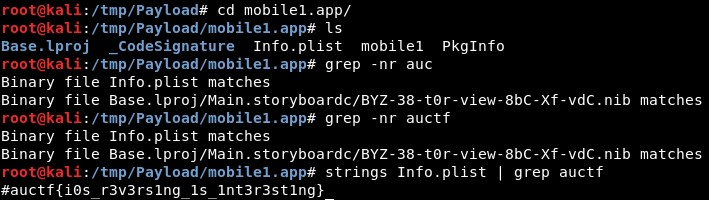
