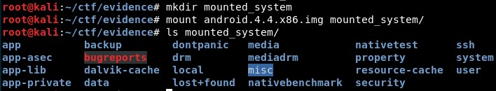
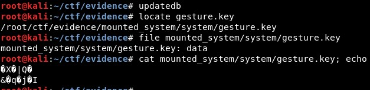
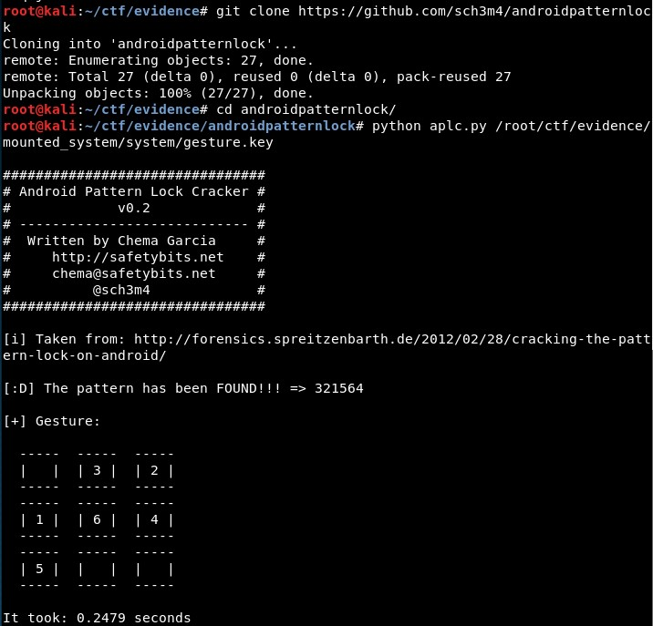

# Locked Kitkat

## Categoría: Forense

Enunciado: *We've extracted the internal disk from the Android device of the suspect. Can you find the pattern to unlock the device? Please submit the correct pattern here*

--------------------------------

En primer lugar se descarga y descomprime la imagen, que se puede montar directamente:

Después, hay que encontrar el fichero *gesture.key* (como se explica [aquí](https://tutorialsoverflow.com/cracking-pattern-lock-protection-android-forensics/) o [aquí](https://infosecaddicts.com/bypass-pattern-locks-android/), se trata del fichero en el que se almacena el patrón de desbloqueo en Android)

Por último, basta con descargar la herramienta [androidpatternlock de Github](https://github.com/sch3m4/androidpatternlock), con la que se obtiene el patrón de forma inmediata:

